# 安全性を重視した生成AI導入の提案

## 更新履歴
- 2025/3/1: 作成

  
  

# 目次
- [自己紹介](#自己紹介)
- [生成AIと従来のPCツールの違い](#生成AIと従来のPCツールの違い)
- [実現したいこと](#実現したいこと)
- [導入のメリット](#導入のメリット)
- [提案例１](#提案例１)
- [提案例２](#提案例２)
- [処理速度の比較](#処理速度の比較)
- [ローカルLLMとクラウド型LLMの活用方法](#ローカルllmとクラウド型llmの活用方法)
- [導入の流れ](#導入の流れ)
- [注目する技術](#注目する技術)

  
  

## 自己紹介

### 来歴
- 設備業界で勤務経験があり、点検や修理の見積もり作成に表計算ソフトを利用。
- 点検や修理の見積もりは既に費用が決定されており、その費用を関数化することで効率化を図った経験。
- その経験がきっかけとなり、IT分野へ関心を持ち独学し転職。
- 作業効率化に繋がるシンプルな仕組み化を重視しており、日ごろから手間を省くための自動化を模索。

### 過去の関心事
- RPA（Robotic process automation）の利用に関心を持ち、GUI操作の自動化や効率化を検討していた。
- BPMN（Business Process Model and Notation）の利用に関心を持ち、業務フローの可視化や知識共有を検討していた。
- いずれも専用のシステム導入が必要であったり、利用者全員が理解する必要があったり、検討が進まない状態となった。

### 最近の関心
- 生成AI、特にLLM (Large Language Model) (大規模言語モデル) による業務効率化、更に安全性を重視したローカルLLM環境の導入。
- 生成AIを活用した情報のインプット・アウトプットの高速化、属人化しがちな業務に対する効率的な知識共有の実現。

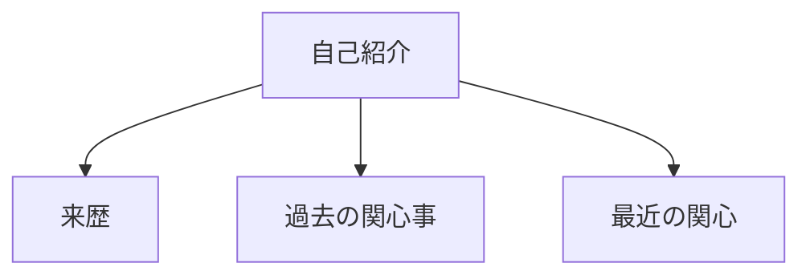

  
  

## 生成AIと従来のPCツールの違い

- 生成AIと従来のPCツールの根本的な違いについて、図表を交えて説明します。
- これらの違いは、コンピュータとの相互作用の根本的な変化を示しています。従来のツールが「特定のタスクのための専用道具」であるのに対し、生成AIは「テキストによる汎用的な道具」と言えるでしょう。

### 根本的な違い

#### 従来のPCツール
- **専用性**: 特定のタスクに特化した機能を提供
- **入力方法**: ボタン、メニュー、コマンドなどの定義された操作方法
- **出力**: 事前に設計された結果（計算結果、編集された画像など）
- **使い方**: 使用目的が明確で、特定の手順に従う必要がある
- **拡張性**: 通常、設計された範囲内での機能拡張
- **学習曲線**: ツール固有のインターフェースや操作を学ぶ必要がある

#### 生成AI（LLM）
- **汎用性**: テキストによる指示だけで多様なタスクに対応
- **入力方法**: 自然言語によるプロンプト（指示）
- **出力**: テキストベースで多様な成果物（文章、コード、アイデアなど）
- **使い方**: 自然言語で目的を伝えるだけでよい
- **拡張性**: プロンプト次第で新しいユースケースに対応可能
- **学習曲線**: 効果的なプロンプト設計の理解が重要

### 生成AI（LLM）と従来のPCツールの詳細比較

| 特性 | 生成AI（LLM） | 従来のPCツール |
|------|--------------|-------------|
| **入力形式** | テキストプロンプト（自然言語） | ボタン、メニュー、コマンド、特定形式のデータ |
| **操作方法** | 会話的・自然言語でのやり取り | UI操作、コマンド入力、定義された手順 |
| **汎用性** | 一つのシステムで多様なタスクに対応 | 特定のタスク領域に最適化 |
| **専門性** | 浅く広い知識と能力 | 特定領域での深い専門性 |
| **学習コスト** | 自然言語で目的を伝えるだけでよい | ツール固有の使い方の習得 |
| **正確性** | プロンプト設計や再生成による工夫が可能 | 定義された範囲内で正確 |
| **速度** | 反復や調整が必要な場合がある | 熟練すれば高速に作業可能 |
| **拡張性** | プロンプト設計により新しい用途に対応可能 | プラグイン、アドオンなどによる拡張 |
| **資源要件** | モデルに応じたGPU/メモリ | タスクに応じた適切なリソース |
| **オフライン使用** | オフラインでも使用可能 | オフラインでも使用可能 |
| **インターフェース** | テキスト中心、チャットGUI又はAPI | 視覚的UI、専用インターフェース |
| **更新方法** | モデルやシステムの最新化 | バージョンアップ、パッチ適用 |
| **データ処理能力** | 大量のテキストデータ処理に適する | 構造化データや特殊形式のデータに強い |
| **創造性** | 新しいアイデアや内容を生成できる | 定義された操作に基づく加工 |
| **制限** | トレーニングデータの範囲内の知識 | 設計された機能の範囲内の処理 |

### 生成AI（LLM）の特徴的な性質

1. **プロンプトによる多様な出力**
   - 同じAIシステムに異なる指示を与えるだけで、全く異なる種類の成果物を生成できる
   - 例：コード生成、文書作成、翻訳、要約、アイデア出しなど

2. **文脈理解と適応**
   - 会話の流れを理解し、前後の文脈に基づいて適切な応答を生成
   - ユーザーとの対話を通じて出力を調整できる

3. **専門知識の必要性の低下**
   - 特定のツールの使い方を知らなくても、自然言語で目的を伝えるだけで成果物を得られる
   - 「どうやって」ではなく「何を」に焦点を当てられる

4. **統合されたエコシステム**
   - 複数のツールを使い分ける代わりに、一つのインターフェースで多様なタスクに対応

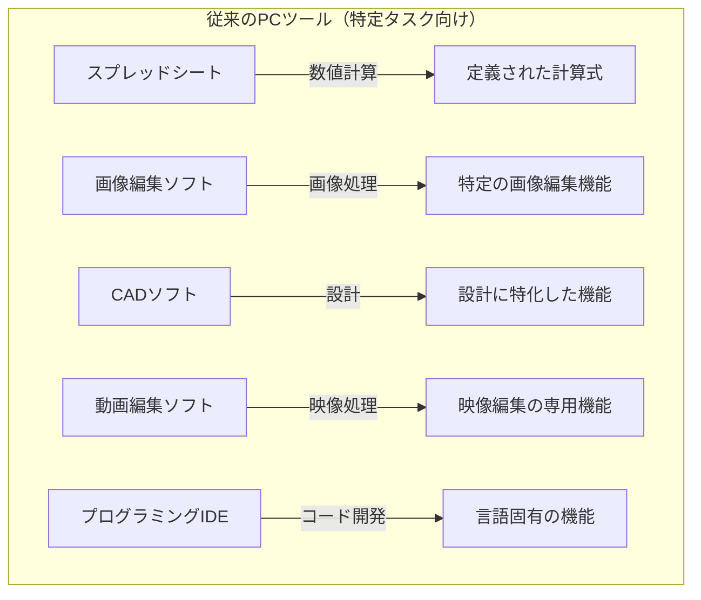
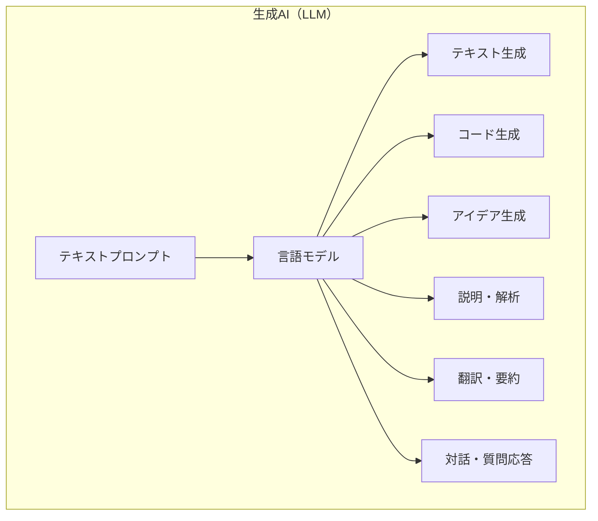

  
  

## 実現したいこと

### 最も効果的なアプローチ
- 生成AIの業務利用を、すぐにでも始める。検証を通じて、実用性を高めていくことが重要。
- 生成AIは急速に進化しているため、最新のノウハウを蓄積しながら検証を進める。
- ツールとしての役割を重視し、利用したい人が利用できる環境を準備。
- 導入に伴う費用対効果は定量的に示すことが難しいため、定性的な評価を通して、実用性を高めていく。
- 検証を重ねる上で、生成AIを高速に処理する専用の機構が必要のため、従来型のサーバでは利用が難しい。検証には専用のサーバが必要となる。
- Mac Mシリーズ 導入により、従来型のサーバと比較し約8倍のスピード差という機能の性質を活かして、生成AIを高速に処理する環境を構築することが望ましい。
- 展望として、github の オンプレミス版を導入し、生成AIを介してメンテナンス可能とする、マークダウン化（マーメイド化）したドキュメントとともに ソースコードを管理する環境を提案。

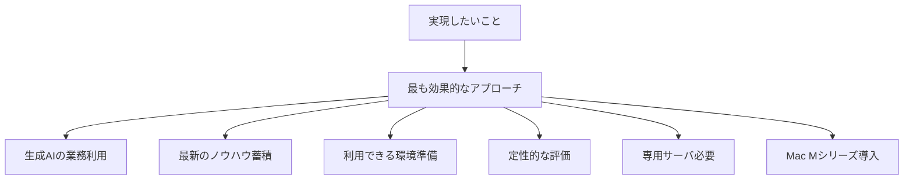

  
  

## 導入のメリット

**1. 業務効率化**
* 情報のインプットとアウトプットの速度が向上し、業務効率化に繋がる可能性がある。
* 専門的なスキルを有するメンバーが増えれば、より高度な業務に対応できるようになる。

**2. 業務別の効果**
* 慣れた業務に対しては、一部業務の効率化や高度な分析を支援し、作業時間の短縮化、知識の共有を促進します。
* 慣れない業務に対しては、学習サポートやミス防止のフィードバックを提供し、効率的な業務遂行を助けます。

**3. シャドーAIの防止**
* シャドーAIとは、組織で管理されていないサービスを利用することで発生する、意図しない情報漏洩や不正使用など、意図しないAIの利用を指す。
* クラウド型LLMは、情報漏洩のリスクが伴う可能性がある。
* ローカルLLMを利用するルールを設けることで、シャドーAIの発生を防止できる。

**4. 組織の柔軟性・先進性の表明**
* 新しい技術を導入し、それを活用する組織であることを示すことで、組織の柔軟性と先進性を内外へアピールすることができる。

**5. 他組織との関係構築**
* 生成AIに関心を持つ他の組織と協力できる可能性がある。
* これにより、新たな技術連携の機会を得られる可能性がある。

**ポイント**
* 業務効率化、シャドーAIの防止、組織の柔軟性と先進性の表明、他組織との関係構築の4点が主なメリットである。
* 生成AIへの関心の高まりを活かし、組織の魅力を高める手段として、生成AI導入を検討する。

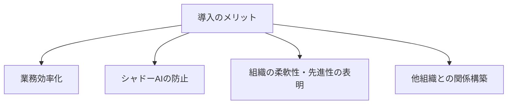

  
  

## 提案例１

初期導入の提案例（2025年3月時点の生成AI分野の状況を反映）

### 1. 目的

生成AIの分野は急速に進化しており、半年前にできなかったことが今だとできるようになっています。 
この提案例では、安全性を重視したローカルLLMの活用を方針としています。
初期導入の提案として、Mac Mシリーズ を導入し、llama.cpp のサーバ機能を活用することで、1.5bの日本語対応モデルを用いたWeb UI利用を目的としています。

### 2. 導入の課題

* 業務に対する生成AIの有効活用がイメージできない。
* クラウド型LLMの利用に関する機密情報の取り扱いに制限がある。
* 従来型のサーバでの検証が難しい。

### 3. 提案内容

* 1.5b日本語対応モデルによる検証
* llama.cpp Web UIの利用
* チーム共通の利用
* Mac Mシリーズ 1台 をレンタルまたは購入

### 4. 期待効果

* メイン業務に対する生成AIの活用を実務に合わせて検証
* 機密情報の取り扱いに関するリスク回避（リスク０）
* 専用サーバによる検証のスピードアップ
* クラウド型LLMとの併用について対応可

### 5. 費用対効果

* 定量的な算出は困難ですが、Mac Mシリーズ 1台 の利用による業務効率の向上を想定し、定性的に評価することが可能です。

### 6. 注意点

* 既存のサーバでの検証は、処理速度やメモリの制約等で実施が難しい可能性があるため、サーバ導入しチーム内での共有利用を希望します。 

### 7. 今後の展望

* Mac Mシリーズ 1台だけでも、利用したい人の間で利用可能になる可能性があります。

  
  

## 提案例２

（枠のみ）

  
  

## 処理速度の比較

この比較表は、各デバイスごとのモデル、モデルサイズ、量子化、TPS（Token Per Second）、TPSの増加倍率（モデルXに対するモデルY、およびデバイスAに対する）、メモリ節約の情報をまとめたものです。

| デバイス       | モデル | モデルサイズ | 量子化 | TPS | TPS (モデルXに対するモデルY) | TPS (デバイスAに対する) | メモリ節約 |
|----------------|--------|--------------|--------|-----|-----------------------------|-------------------------|------------|
| **デバイスA** (CPUのみ) | モデルX | 7b       | q5    | 0.8 | -                           | -                       | -          |
|                | モデルY | 1.5b        | q8    | 4.0 | 5倍                         | -                     | メモリ節約 |
| **Mac Mシリーズ** (Unified Memory, CPU & GPU) | モデルX | 7b       | q5    | 11.3 | -                           | 15倍                    | -          |
|                | モデルY | 1.5b        | q8    | 32.0| 3倍                         | 8倍                    | メモリ節約 |
| **デバイスC** (GPUのみ) | モデルX | 7b       | q5    | 34.4| -                           | 45倍                    | -          |
|                | モデルY | 1.5b        | q8    | 96.0| 3倍                         | 24倍                    | メモリ節約 |

  
  

## ローカルLLMとクラウド型LLMの活用方法

### 1. 用途別に分ける

#### 1.1 クラウド型LLM

- **機密情報なしのタスク**：
    - 複雑な調査や概要把握
    - 機密情報が含まれない文章の解析や清書
    - 機密情報が含まれないコーディング

#### 1.2 ローカルLLM

- **機密情報の含むタスク**：
    - 個人の情報や機密性の高い情報を含む文章の解析と清書
    - 機密情報が含まれるコーディング

#### 1.3 ハイブリッドアプローチ

- **クラウド型LLMの出力**をローカルLLMにフィードする
- ローカルLLMで機密情報を除去し、クラウド型LLMで更なる深掘りを行う

### 2. ユーザー規模

#### 2.1 クラウド型LLM
- 大規模なユーザー群での利用を想定
- 機密情報を含まないタスクへの対応

#### 2.2 ローカルLLM
- 1台のサーバで共有利用を想定
- 機密情報が含まれるタスクへの対応
- 少数のユーザー群での利用

### まとめ
ローカルLLMは、クラウド型LLMと併用することで、機密情報の取り扱いに関する安全性を確保しながら、多様なニーズに対応することができます。また、クラウド型LLMとローカルLLMのそれぞれの強みを活かしたハイブリッドアプローチにより、より柔軟で効率的な利用を実現することが可能です。

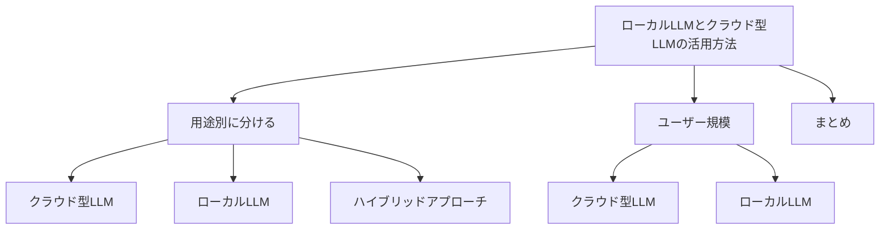

  
  

## 導入の流れ

### 1. アプローチ
* **段階的なアプローチ:** 少量で運用を開始し、評価結果に基づいて段階的な導入を判断するというアプローチが現実的で効率的。

### 2. 実施のメリット
* **リスク軽減:** 大規模な導入による失敗リスクを最小限に抑えられる。
* **ニーズの確認:** 実際の業務環境での効果を検証することで、導入の必要性や規模を判断できる。

### 3. 実施計画案
* **1台導入・評価:** 初期段階では、1台の生成AIサーバを導入し、運用開始後、1か月または数週間で評価を実施。
  * **評価内容:** 定性的な効果（ユーザー満足度、使いやすさ、課題など）
  * **評価方法:** アンケート調査、インタビューなど
* **評価結果に基づく判断:** 評価結果が一定の基準を満たさない場合、または予想した効果が得られない場合は、導入を中断し、他の方法を検討する。
* **継続的なモニタリング:** 導入後も定期的に評価を行い、効果を継続的に確認し、必要に応じて調整。

### 4. 継続的な学習
* **最新技術動向の把握:** 生成AI分野は急速に発展しているため、最新の技術動向を継続的に調査し、導入検討の材料とする。
* **パートナー企業との連携:** 専門家やベンダーと連携し、効果的な導入方法や最適なプラットフォームを選定する。

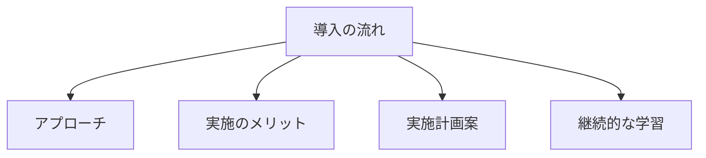

  
  

## 注目する技術

### 1. ファインチューニング (Fine-Tuning) (追加学習)

- **概要**: 事前学習済みのモデルを新たなデータセットでさらに学習させることで、特定のタスクに特化した性能を向上させる技術。
- **できること**:
    - **追加学習**: 事前学習済みのモデルに不足している業務知識などのドメイン知識を追加で学習し、業務に特化したモデルの作成。
- **必要なもの**: 
    - **事前学習済みモデル**: 研究機関や企業が公開している大規模言語モデル（例: BERT, GPT）。
    - **新たなデータセット**: 特定のタスクや業界に特化したテキストデータ。
    - **計算資源**: 大規模なデータセットを学習するために、GPUやTPUなどの高性能計算機が必要。

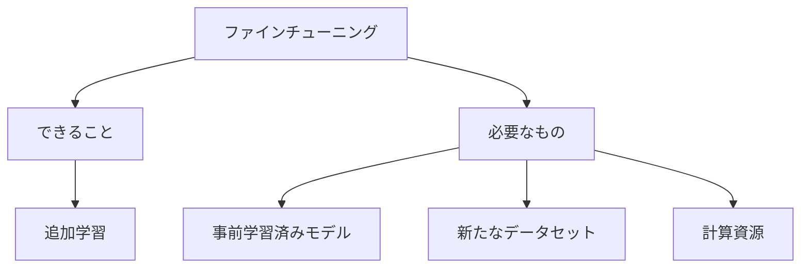

  
  

### 2. RAG (Retrieval-Augmented Generation) (検索拡張生成)

- **概要**: モデルがまだ知り得ない情報や知識を、外部の情報源（例えば、インターネット上の記事や書籍）から取得し、それらを基に生成を補強する技術。
- **できること**:
    - **検索拡張生成**: モデルに不足している業務知識などのドメイン知識を補い推論が可能。
- **必要なもの**: 
    - **専用システムやデータベース**: 外部ソースから取得した情報を格納・検索できる仕組み。
    - **LLM**: 外部データから情報を取得し、適切な形式に変換してモデルに提供できる能力を持つモデル。

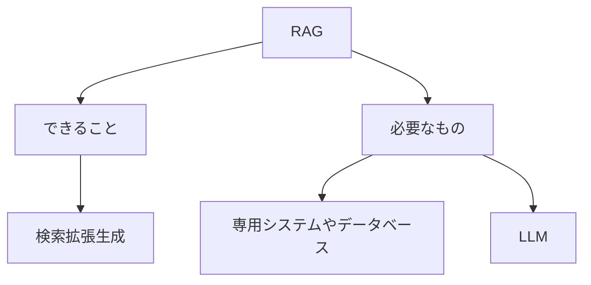

  
  

### 3. Long-Context LLMs (長文読解)

- **概要**: 長い文脈を直接モデルに入力してそのまま処理・応答するテクノロジ。
- **できること**:
    - **長文読解**: 通常のLLMと比較し、長文を読解することが可能。システムやドキュメント全体をベースとした推論が可能。
- **必要なもの**: 
    - **LC用のトレーニング済みモデル**: 長い文脈を正確に理解し、適切な応答を生成できるようにトレーニングされたモデル。
    - **テキストデータ**: 長文のメンテナンス済みテキストデータ。

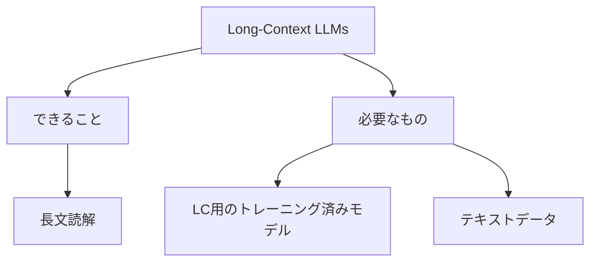

  
  

### 4. Vision-Language Model (VLM, 画像言語モデル)

- **概要**: 画像とテキストを複合して扱うモデル。
- **できること**:
    - **画像読解**: 入力した画像を読解し、テキスト化（マークダウン形式・マーメイド形式、など）、LLMと同様に推論するなど。
- **必要なもの**:
    - **ドキュメントから画像へ変換できるシステム**: ドキュメントを画像へ変換し、画像をVLMへ入力できる仕組みが必要。

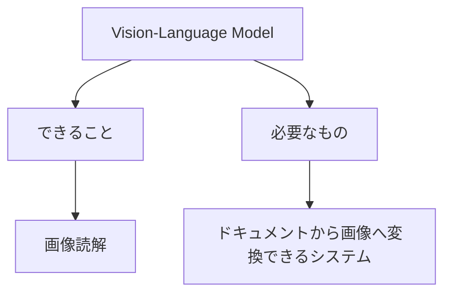

  
  

### 5. Agentic Workflow (ワークフロー)

- **概要**: テキスト処理の各タスクを細分化し、それぞれのタスクを専用のLLMやアプリケーションの実装を組み合わせて行う技術。
- **できること**:
    - **一連のタスク実行**: 入力した情報をもとにワークフローに沿って成果物を作成。
- **必要なもの**:
    - **タスクの細分化**: テキスト処理の各ステップを明確に定義。
    - **各ステップの適切なLLMやアプリケーションの選択**: 各タスクに最適なモデルやシステムの選択。
    - **ワークフローの実装と管理**: 各ステップの実行手順、結果の取り扱い、問題発生時の対応などを規定。

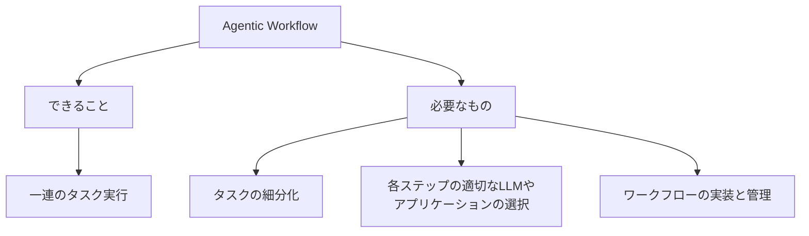

  
  

### 6. AI agent (エージェント)

- **概要**: 環境を認識し、行動を起こすことができる自動化されたシステム。
- **できること**:
    - **ファイル作成・設定変更**: ソースやドキュメントを自動で作成・修正、環境構築や設定変更が可能。
- **必要なもの**:
    - **環境認識機能**: AIエージェントがが周囲の環境を理解できる機能。
    - **行動の実行機能**: AIエージェントが行動を実行できる機能（例えば、タスクの実行、データの取得）。
    - **隔離環境**: AIエージェントが既存の環境に悪影響を及ぼさないように隔離された環境が必要。

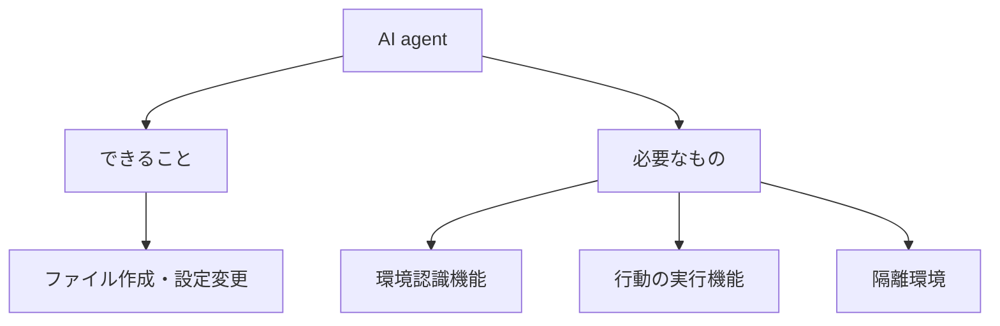

  
  

### 7. AGI (人工汎用知能)

- **概要**: AGI（Artificial General Intelligence）は、人間と同等の知能を持ち、幅広いタスクを自己学習し遂行できる人工知能。
- **できること**:
    - **自己学習機能**: 生成AIと異なり、人間のように経験から学び、適応する能力。
    - **多様なタスク処理能力**: 生成AIと異なり、特定のタスクに限定されず、幅広いタスクを処理できる能力。
- **必要なもの**:
    - **AGIの実現**: 2025年3月時点で、AGIは実現されていない（少なくとも公開されていない）ことから、AGIの実現を待つ。
    - **倫理的ガイドライン**: AGIが実現したとして、AGIの行動が倫理的・社会的に適切であることを保証するガイドライン。

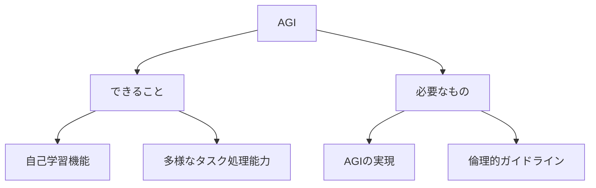

  
  
